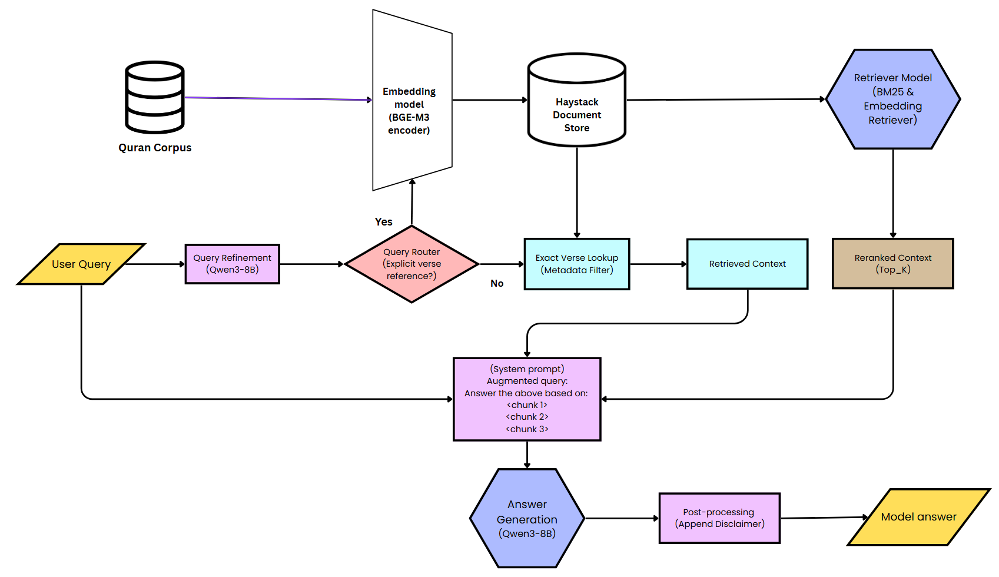

# JAWAB-RAG

Jawab-RAG is a retrieval-augmented Q\&A system for Quran-related questions.
It fetches the most relevant verses (Arabic + translation) and uses the Qwen3-8B language model to generate grounded answers with citations.

## FEATURES

• Hybrid retrieval: BM25 + dense embeddings (FAISS)

• Multilingual answers (English, Malay/Indonesian, Arabic)

• Structured output: Arabic verse, translation, verse reference

• Baseline “LLM-only” script for comparison

• Automated evaluation with RAGAS



## QUICK-START

1. Clone the repo

   ```
   git clone https://github.com/mirzasyhm/Jawab-RAG.git
   cd Jawab-RAG
   ```

2. Install requirements 

   ```
   pip install -r requirements.txt
   ```

3. Run demo and evaluation

   ```
   python main.py            # full RAG pipeline
   python baseline/main.py   # LLM-only baseline
   ```

Optional: set an OpenAI key for full RAGAS metrics

```
   export OPENAI_API_KEY=your_openai_key
```

For easiness, you may run the jawab_rag.ipynb in Colab. 


## DISCLAIMER

The answers produced are AI-generated for study purposes only.
For authoritative religious rulings, please consult a qualified Islamic scholar.
